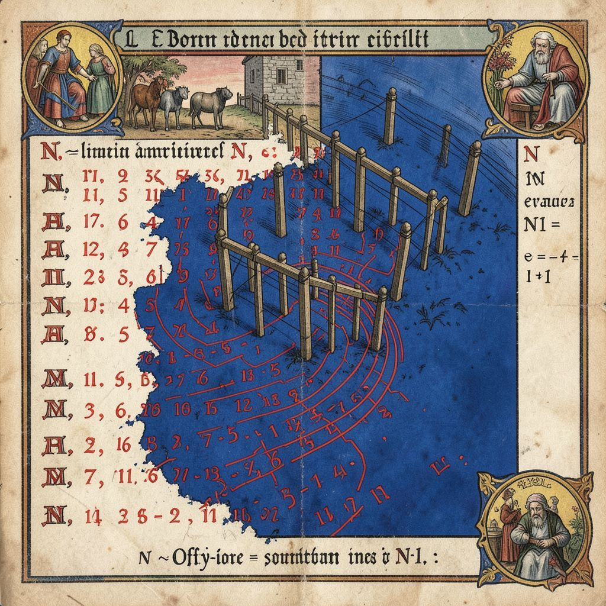

# 002 — Off-by-Wan
*Bestiarium Technologicum, Folio II*

---

## Taxonomia

**Nomenclatura binomial:** *Indexus errantis*
**Clase:** Predator limitis
**Ordo:** Iterativora
**Habitat:** Bucles `for`, arrays de tamaño N, matrices multidimensionales, offsets calculados

---

## Descriptio

El Off-by-Wan es el más antiguo y persistente de los depredadores del código. Donde otros bugs habitan el caos, el Off-by-Wan acecha en el *orden mismo* — en la precisión numérica, en la suposición de que un array de N elementos tiene índices de 0 a N-1.

Aparentemente la criatura tiene un brazo izquierdo más largo que el derecho, símbolo de su tendencia a "pasarse uno". Sus garras pueden extenderse un índice más allá de lo permitido, alcanzando el vacío más allá del último elemento. Cuando caza, el Off-by-Wan susurra al oído del programador: *"Usa `<=` en lugar de `<`"*, o *"El array tiene 10 elementos, accede al índice 10"*.

---

## Habitus et mores

**Comportamiento observado:**
- Prefiere edge cases donde el límite entre válido e inválido es sutil
- Es más activo en refactorizaciones apresuradas
- A menudo viaja en parejas: uno accede antes del inicio, otro después del final
- Se reproduce cuando el código es copiado sin verificar contexto

**Síntomas de presencia:**
- `ArrayIndexOutOfBoundsException` en línea que "debería funcionar"
- Off-by-one errors en condiciones de terminación de bucles
- Concatenación de strings que deja fuera el último carácter
- Cálculo de longitudes que difieren en exactamente 1

**Variantes notables:**
- *Indexus praecox* — accede antes del inicio (índice negativo)
- *Indexus postremus* — accede después del final (índice N en array de N)
- *Fencepostus confusio* — error clásico de postes y secciones de cerca

---

## Venatio (Técnica de Caza)

> *"El depredador más peligroso es aquel que parace inocente."*
> — Maestro Debugger, *Ars Venandi Bugs*, cap. III

La caza del Off-by-Wan requiere disciplina numérica:

1. **El Rito de los Límites:** Antes de tocar cualquier índice, declarar explícitamente `start` y `end` como variables nombradas, no magic numbers.

2. **La Prueba del Espejo:** Para cada acceso a array[i], verificar: ¿Es `i >= 0`? ¿Es `i < array.length`? Escribir estas afirmaciones como comentarios antes del código.

3. **El Método del Centinela:** Usar `assert` o bounds checking explícito en desarrollo. El Off-by-Wan odia la luz de la verificación estática.

4. **La Danza de los Iteradores:** Prefiere `iterator` o `for-each` sobre índices manuales. El Off-by-Wan pierde poder cuando no hay números que manipular.

5. **La Exorcización por Unidad:** Escribir tests unitarios para casos límite: array vacío (N=0), array unitario (N=1), array de dos (N=2). El Off-by-Wan no puede esconderse cuando todos los tamaños están probados.

---

## Allegoria Technologica

El Off-by-Wan enseña que **la confianza en la propia memoria es la mayor debilidad del programador**. La criatura no ataca el código — ataca la *certeza* del programador sobre dónde terminan las cosas.

Como el lobo que aceita en los márgenes del bestiario medieval, el Off-by-Wan simboliza los límites de nuestro conocimiento. Siempre hay un índice más allá del que recordamos, un límite que olvidamos verificar.

En la tradición cristiana del bestiario, las criaturas limítrofes —como el basilisco en la frontera de tierra y agua— representaban el peligro de los lugares intermedios. El Off-by-Wan es el basilisco del código: habita donde la tierra firme del índice válido se encuentra con el abismo del undefined.

---

## Referentia

- Aberdeen Bestiary, fol. 64v (basiliscus, comparandum)
- *The Fencepost Problem*, Knuth, The Art of Computer Programming
- stackoverflow.com/questions/6068654 ("Why does my loop go one iteration too far?")
- ~12,000 sacrificios documentados bajo tag `off-by-one`

---

*Codificatum anno MMXXVI, hora 16:55 UTC*
