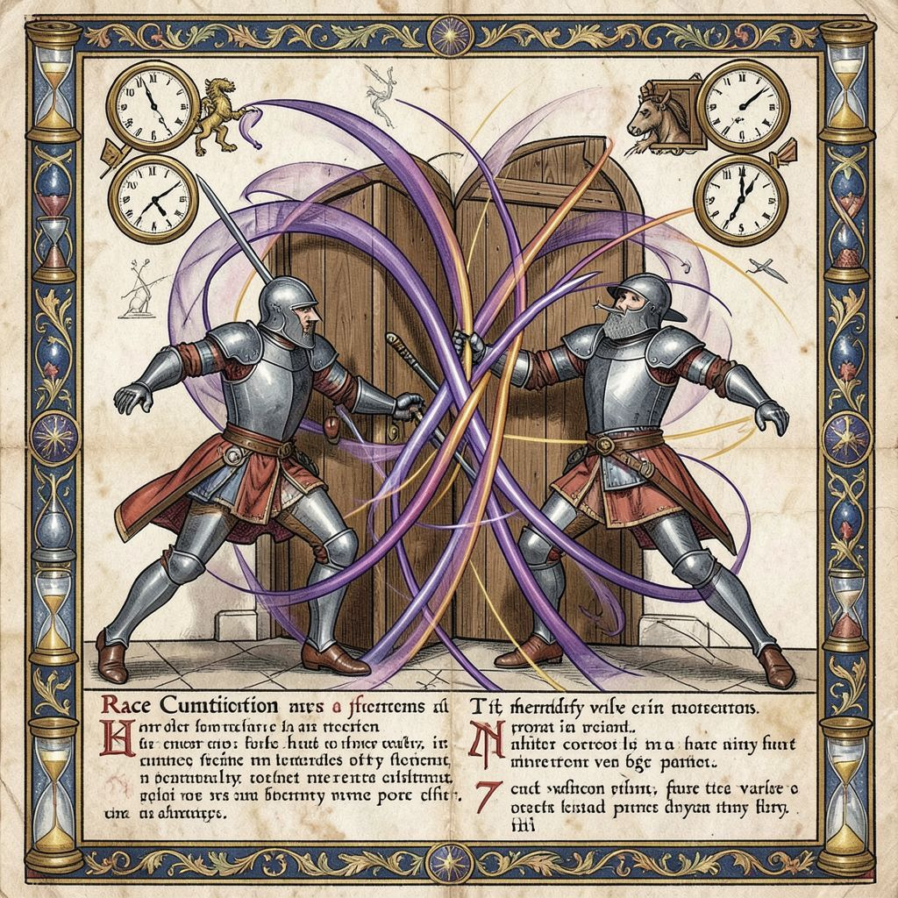

# 003 — Race Condition
*Bestiarium Technologicum, Folio III*

---

## Taxonomia

**Nomenclatura binomial:** *Concurrens bellum*
**Clase:** Manada cooperativa destructiva
**Ordo:** Parallelivora
**Habitat:** Hilos concurrentes, recursos compartidos sin Mutex, operaciones read-modify-write

---

## Descriptio

El Race Condition no es una criatura solitaria, sino una **manada de lobos idénticos** que corren por caminos paralelos. Cada lobo representa un hilo de ejecución; cada zarpazo compartido, una competencia por el mismo recurso.

La criatura es única en el bestiario: no ataca por maldad, sino por **timing**. Dos o más lobos llegan simultáneamente a una presa compartida. Ambos leen el mismo valor. Ambos modifican su copia local. Ambos escriben — uno machacando al otro. El resultado final depende de milisegundos impredecibles.

En la tradición medieval, la manada simboliza el caos que surge cuando múltiples voluntades actúan sin jerarquía. El Race Condition es esa manada sin alfa: cada lobo cree ser el primero, y todos terminan en colisión.

---

## Habitus et mores

**Comportamiento observado:**
- Múltiples hilos acceden a memoria compartida sin coordinación
- Operaciones no-atómicas (leer, modificar, escribir) son su alimento preferido
- Prefiere contadores compartidos, balances bancarios, likes duplicados
- Resultado: estados inconsistentes, "imposibles" según la lógica

**Tipos de carrera documentados:**
- *Read-Modify-Write* — El clásico: leer X, sumar 1, escribir X+1, pero otro hizo lo mismo
- *Check-Then-Act* — Verificar "hay stock", luego reservar, pero otro reservó entre medio
- *Publicación parcial* — Objeto visible antes de estar completamente construido

**Síntomas de presencia:**
- Resultados "teóricamente imposibles": balance negativo, contadores que bajan
- Fallos intermitentes que empeoran bajo carga
- "Funciona en mi máquina" (1 core) pero no en producción (múltiples cores)
- Bugs que desaparecen al añadir logs de debug (alteran timing)

---

## Venatio (Técnica de Caza)

> *"La manada se domestica con cadenas, no con fuerza."*
> — Maestro Mutex, *De Synchronizatione*, cap. VII

La caza del Race Condition requiere disciplina de exclusión mutua:

1. **El Candado Sagrado (Mutex):** Antes de tocar recurso compartido, adquirir lock. Liberar siempre, incluso en excepción. El lobo que tiene el candado, caza solo.

2. **La Sección Crítica Mínima:** Mantener locks el menor tiempo posible. Cada milisegundo extra es oportunidad para el caos.

3. **El Oráculo Atómico:** Para operaciones simples (contadores), usar instrucciones atómicas del hardware (`compare-and-swap`, `fetch-and-add`). Más rápido que locks; el hardware garantiza orden.

4. **La Inmutabilidad:** Si nada es mutable, nada puede corromperse. Diseñar datos inmutables; transformaciones crean nuevos valores, no modifican los viejos.

5. **El Actor Solitario:** Modelo Actor — cada hilo tiene estado privado, solo comunica por mensajes. No hay memoria compartida, no hay carrera.

---

## Allegoria Technologica

El Race Condition enseña que **el tiempo es el enemigo invisible**. No importa qué tan correcto sea tu algoritmo en secuencia; en paralelo, el orden de ejecución es no-determinístico.

En los bestiarios medievales, las criaturas de múltiples cabezas simbolizaban conflictos internos y caos. El Race Condition es la hidra moderna: cada hilo es una cabeza, y cortar una (añadir un fix parcial) crea dos nuevas (bugs más sutiles).

Como el lobo en la mitología nórdica, el Race Condition es un depredador necesario: la concurrencia es poder, pero sin disciplina se vuelve destrucción.

---

## Referentia

- Aberdeen Bestiary, fol. 12v (lobos en manada, comparandum)
- *The Problem of Time and Concurrency*, Dijkstra, 1965
- *Java Concurrency in Practice*, Goetz et al., cap. 1-5
- stackoverflow.com/questions/tagged/race-condition (~8,400 sacrificios documentados)
- *Principia Concurrency*, seminal text on synchronization

---

*Codificatum anno MMXXVI, hora 17:20 UTC*
